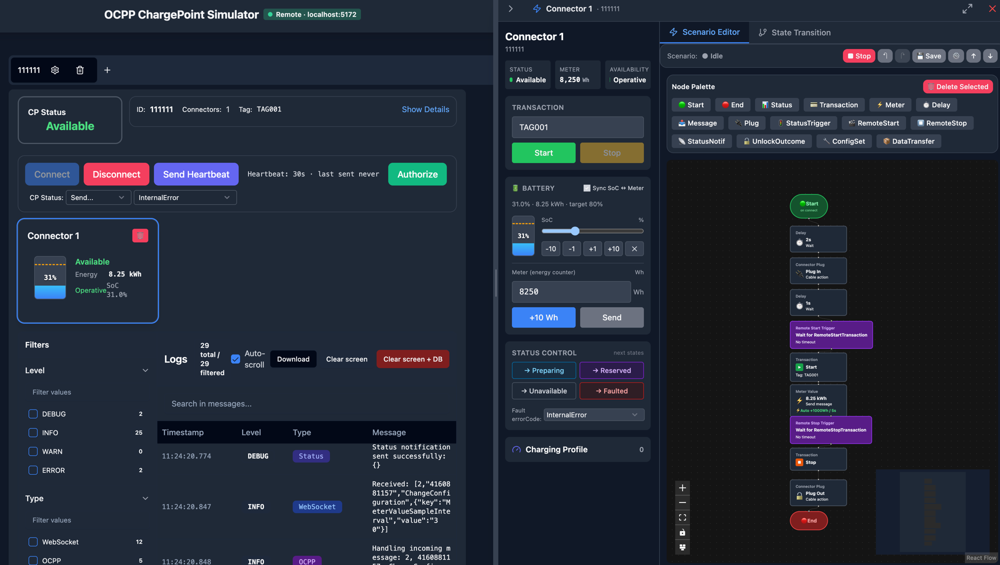

# OCPP CP Simulator

[](https://deepwiki.com/shiv3/ocpp-cp-simulator)

OCPP 1.6J charge point simulator for **AI agent testing**, CI automation, and CSMS development. Comes with a browser UI, a headless CLI, and a Socket.IO control API that any agent or script can drive.

| Interface       | Description                                            | Docs                                                 |
| --------------- | ------------------------------------------------------ | ---------------------------------------------------- |
| **Browser**     | Classic console (default, at `/`) / Tauri desktop app  | [docs/guides/browser.md](docs/guides/browser.md)     |
| **New console** | Redesigned console (React + Tailwind), served at `/v3` | [docs/guides/browser.md](docs/guides/browser.md)     |
| **Legacy v1**   | Original single-page web UI, served at `/v1`           | [docs/guides/legacy-v1.md](docs/guides/legacy-v1.md) |
| **CLI**         | Headless mode for scripting, CI, and AI integration    | [docs/reference/cli.md](docs/reference/cli.md)       |
| **Server**      | Long-running Socket.IO server, multi-CP per process    | [docs/reference/server.md](docs/reference/server.md) |
| **Docker**      | Pre-built image (daemon + web console) on GHCR         | [docs/guides/docker.md](docs/guides/docker.md)       |



## Quick Start

```bash
# Install dependencies
npm install

# Browser UI (dev server)
npm run dev

# CLI / Server mode (requires Bun)
ocpp-cp-sim --ws-url ws://localhost:9000/ocpp --cp-id CP001
```

Full install options (global `ocpp-cp-sim` command, pinned releases, `bun link`), first-run recipes, Docker, and reverse-proxy notes: [docs/getting-started.md](docs/getting-started.md).

> **SOAP versions (1.2 / 1.5 / 1.6S):** full bidirectional SOAP from the CLI/daemon, send-only in the browser — see [docs/guides/soap.md](docs/guides/soap.md).
> **OCPP 1.6 security profiles 1–3:** Basic Auth, server-cert verification, mutual TLS — see [docs/guides/security-profiles.md](docs/guides/security-profiles.md).

> **Driving the simulator from AI agents, scripts, or JVM tests** (Socket.IO RPC, MCP endpoint, runnable Node/Python examples, Testcontainers): see [docs/guides/automation.md](docs/guides/automation.md).

## Persistence

Both the browser UI and the daemon back their state with SQLite — sql.js + IndexedDB in the browser, `bun:sqlite` (via `--state-db <path>`) in the daemon. Scenarios, ChangeConfiguration overrides, charging profiles, availability flags, pending transaction messages, the daemon's CP registry and logs all survive reload / restart. See [docs/reference/server.md → State persistence](docs/reference/server.md#state-persistence).

## Web console layout

The browser app serves the UIs under distinct route prefixes from the same origin:

- **`/`** — the classic console (the default). Also reachable at **`/v2`** for backward-compatible bookmarks.
- **`/v3`** — the redesigned console: a fleet of **Charge Points**, per-charge-point detail (`/v3/cp/:id`), a cross-CP **Scenario library** with a linear step editor and a separate run console (`/v3/scenarios`), and a global **Message log** (`/v3/logs`).
- **`/v1`** — the original single-page UI (maintenance only).

The two consoles link to each other with a design switcher (the classic navbar's **New design** button ↔ the redesigned sidebar's **Switch to classic design** button).

The redesign reuses the existing data layer, scenario engine, and per-step forms unchanged; scenarios, charge points, and logs are simply promoted to first-class routes instead of nested panels.

## Local vs Remote mode (browser)

The browser UI auto-detects which mode to run in by probing `/v1/healthz` at its own origin (path configurable, see [docs/reference/server.md → Health](docs/reference/server.md#health)):

- Served by `ocpp-cp-sim --web-console`, the Docker image, or the **Tauri desktop app** (which bundles the daemon as a sidecar) → **Remote**: every operation uses the daemon's Socket.IO control plane.
- Static build (GitHub Pages, `bun run dev`) → **Local**: charge points run entirely in-browser, persistence via sql.js.

There is no toggle — the mode is decided once on page load and never overridden.

## Doc

https://deepwiki.com/shiv3/ocpp-cp-simulator

## Contributing

Review `AGENTS.md` for repository guidelines covering project layout, required commands, and pull request expectations.
