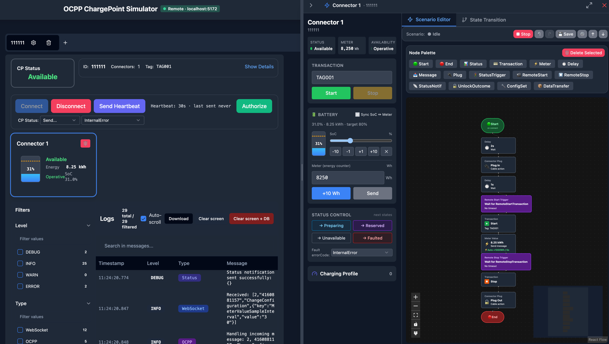

# OCPP CP Simulator

[](https://deepwiki.com/shiv3/ocpp-cp-simulator)

OCPP 1.6J charge point simulator for **AI agent testing**, CI automation, and CSMS development. Comes with a browser UI, a headless CLI, and a Socket.IO control API that any agent or script can drive. Also speaks OCPP 2.0.1 / 2.1 (WebSocket) and OCPP 1.2 / 1.5 / 1.6S (SOAP).

| Interface       | Description                                             | Docs                                                                                      |
| --------------- | ------------------------------------------------------- | ----------------------------------------------------------------------------------------- |
| **Browser**     | Classic console (default, at `/`) / Tauri desktop app   | [Web console](docs/entities/web-console.md) · [Desktop app](docs/entities/desktop-app.md) |
| **New console** | Redesigned console (React + Tailwind), served at `/v3`  | [Web console → Layout](docs/entities/web-console.md#layout-route-prefixes)                |
| **Legacy v1**   | Original single-page web UI, served at `/v1`            | [Legacy v1 UI](docs/entities/legacy-v1-ui.md)                                             |
| **CLI**         | Headless mode for scripting, CI, and AI integration     | [CLI](docs/entities/cli.md)                                                               |
| **Server**      | Long-running Socket.IO server, multi-CP per process     | [Daemon](docs/entities/daemon.md) · [Control plane](docs/concepts/control-plane.md)       |
| **Docker**      | Pre-built image (daemon + web console) on GHCR          | [Docker image](docs/entities/docker-image.md)                                             |
| **MCP**         | `POST /mcp` tools for Claude Code and other MCP clients | [MCP endpoint](docs/entities/mcp-endpoint.md)                                             |



## Quick Start

```bash
# Install dependencies
npm install

# Browser UI (dev server)
npm run dev

# CLI / Server mode (requires Bun)
ocpp-cp-sim --ws-url ws://localhost:9000/ocpp --cp-id CP001
```

### Install as a global command (`ocpp-cp-sim`)

```bash
# pnpm (recommended)
pnpm install -g https://github.com/shiv3/ocpp-cp-simulator/releases/latest/download/ocpp-cp-simulator.tgz

# bun
bun install -g https://github.com/shiv3/ocpp-cp-simulator/releases/latest/download/ocpp-cp-simulator.tgz

# Or pin to a specific CLI release
bun install -g https://github.com/shiv3/ocpp-cp-simulator/releases/download/cli-v0.1.0/ocpp-cp-simulator-0.1.0.tgz

# From a local checkout
bun link              # in this repo
bun link ocpp-cp-simulator   # in any other project
```

> The release tarballs are produced by the `Release CLI` workflow on `cli-v*` tags. A bare `bun install -g github:shiv3/ocpp-cp-simulator` does **not** work — `dist/` is built at release time, not committed, and bun doesn't install devDependencies for global packages so the on-install `vite build` can't run.

Then run from anywhere:

```bash
# Interactive REPL against a CSMS
ocpp-cp-sim --ws-url ws://localhost:9000/ocpp --cp-id CP001

# Headless daemon (Socket.IO control API only)
ocpp-cp-sim --daemon --http-port 9700

# Daemon + bundled browser UI on the same origin
#   open http://127.0.0.1:5172 to drive the daemon from the web console
ocpp-cp-sim --http-port 5172 --web-console \
            --cp-id CP001 --connectors 2 \
            --ws-url wss://csms.example.com/ocpp/

# Full kitchen-sink: persistent SQLite, JSON-line logs, demo scenario auto-loaded
ocpp-cp-sim --http-port 5172 --web-console \
            --cp-id CP001 --connectors 5 \
            --ws-url wss://csms.example.com/ocpp/ \
            --scenario-template-file docs/examples/scenarios/demo-charging.json \
            --scenario-connector all \
            --state-db ./state.db --log-format json
```

`--web-console` serves the browser UI (built into `dist/` and shipped inside the release tarball) from the same HTTP port as the Socket.IO control plane, so a single port is all you need to expose. See [CLI](docs/entities/cli.md) for the full flag reference and [Control plane](docs/concepts/control-plane.md) for the Socket.IO protocol.

> **Behind a reverse proxy?** Bound to a non-loopback host the daemon applies a safe same-origin CORS policy, so the web console served at a public URL will `403` its own assets until you name that origin with `--cors-origin https://your.url` (or, behind a trusted proxy, `--trust-forwarded-headers`). See [Access control → Behind a reverse proxy](docs/concepts/access-control.md#behind-a-reverse-proxy-traefik-nginx-caddy-) for details and an nginx + Authelia example compose.

## Documentation

`docs/` is organized as an [LLM Wiki](https://gist.github.com/karpathy/442a6bf555914893e9891c11519de94f): an interlinked knowledge base maintained by an LLM agent under the schema in [`CLAUDE.md`](CLAUDE.md).

- **Start here:** [Overview](docs/overview.md) · [Index of all pages](docs/index.md) · [Choosing an interface](docs/analyses/choosing-an-interface.md)
- **Entities** — [CLI](docs/entities/cli.md), [analyze](docs/entities/analyze.md), [Daemon](docs/entities/daemon.md), [Web console](docs/entities/web-console.md), [Desktop app](docs/entities/desktop-app.md), [Docker image](docs/entities/docker-image.md), [MCP endpoint](docs/entities/mcp-endpoint.md), [Scenario templates](docs/entities/scenario-templates.md), [CSMS peers](docs/entities/csms-peers.md)
- **Concepts** — [Control plane](docs/concepts/control-plane.md), [Scenario format](docs/concepts/scenario-format.md), [Trace format](docs/concepts/trace-format.md), [State persistence](docs/concepts/state-persistence.md), [Log format](docs/concepts/log-format.md), [Network simulation](docs/concepts/network-simulation.md), [Access control](docs/concepts/access-control.md), [OCPP versions & transports](docs/concepts/ocpp-versions-and-transports.md), [Security profiles](docs/concepts/security-profiles.md), [Local vs Remote mode](docs/concepts/local-vs-remote-mode.md)
- **Analyses** — [Driving from an AI agent](docs/analyses/driving-from-an-ai-agent.md), [REST → Socket.IO migration](docs/analyses/rest-to-socketio-migration.md), [Testing strategy](docs/analyses/testing-strategy.md)
- **Sources** — summaries of the raw inputs (JSON schemas, example files, sibling READMEs, issues): [docs/sources/](docs/index.md#sources-sources)

Also browsable at https://deepwiki.com/shiv3/ocpp-cp-simulator.

## Highlights

- **AI agent & automation testing** — structured JSON logs, one Socket.IO `rpc`/`event` contract, an MCP endpoint, runtime-injected scenario templates with machine-readable verdicts, an unauthenticated health probe, and SQLite persistence. Minimal recipe and client options: [Driving from an AI agent](docs/analyses/driving-from-an-ai-agent.md).
- **SOAP versions (1.2, 1.5, 1.6S)** — full bidirectional OCPP-S in CLI / server mode, send-only in the browser: [OCPP versions & transports](docs/concepts/ocpp-versions-and-transports.md).
- **OCPP 1.6 security profiles 1–3** — Basic Auth with `AuthorizationKey`, server-certificate verification, mutual TLS: [Security profiles](docs/concepts/security-profiles.md).
- **Network simulation** — seeded latency / jitter, forced and periodic disconnects, delayed reconnect, configured at runtime: [Network simulation](docs/concepts/network-simulation.md).
- **Certification scenarios** — 47 `cert16-*` templates covering the OCPP 1.6 test cases, verified against SteVe: [Scenario templates](docs/entities/scenario-templates.md).
- **Diagnostics** — versioned OCPP trace files and DebugKit reports via `ocpp-cp-sim analyze`: [analyze](docs/entities/analyze.md).
- **Persistence** — the browser (sql.js + IndexedDB) and the daemon (`--state-db`) share one SQLite schema: [State persistence](docs/concepts/state-persistence.md).
- **Local vs Remote mode** — the browser decides once per load by probing `/v1/healthz`: [Local vs Remote mode](docs/concepts/local-vs-remote-mode.md).

## Contributing

`CLAUDE.md` is the schema for the documentation wiki (layers, layout, ingest / query / lint workflows); `docs/conventions.md` holds the page conventions. When a change alters behaviour, update the affected wiki pages, `docs/index.md` and `docs/log.md` in the same PR.
