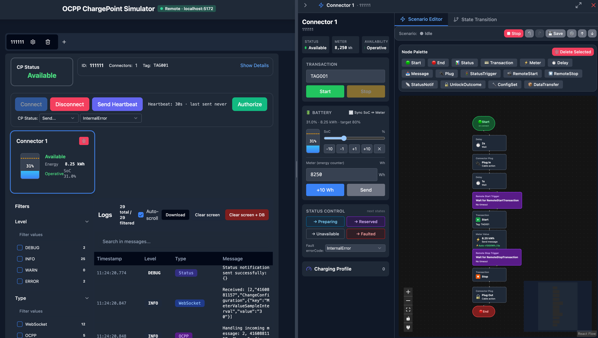

# Web console (browser UI)

React + TypeScript web application with Flowbite/Tailwind UI. The same bundle
(`dist/`, built by Vite) is served in three ways: the hosted static site, the
[daemon](daemon.md) with `--web-console` (and therefore the
[Docker image](docker-image.md)), and the [desktop app](desktop-app.md).



## Web Version

https://shiv3.github.io/ocpp-cp-simulator/

The hosted web version runs in **Local mode** — every charge point lives in the
browser tab, persisting to IndexedDB via sql.js. Closing the tab keeps the data;
clearing site data drops it.

When the same React UI is served by `ocpp-cp-sim --web-console`, the Docker
image, or the desktop app, it runs in **Remote mode**. The page first probes
`/v1/healthz` at its own origin; a `200` response with `{ "ok": true }` means a
daemon is present. After that detection, all simulator control uses the same
Socket.IO connection documented in [Control plane](../concepts/control-plane.md):
`rpc` acks for commands and `event` push envelopes for CP / registry updates.
The detection rules are in [Local vs Remote mode](../concepts/local-vs-remote-mode.md).

## Layout (route prefixes)

The browser app serves one web console, plus the classic UI during a
transition, from the same origin:

- **`/`** — the web console: a fleet of **Charge Points**, per-charge-point
  detail (`/cp/:id`), a cross-CP **Scenario library** (`/scenarios`; each
  row's `…` menu — Duplicate, Export JSON, Delete — opens in a portal and
  flips upward near the bottom of the window, so it is never clipped by the
  table, #365) with an editor (`/scenarios/edit`, see
  [Scenario editor](#scenario-editor-steps-and-graph)) and a separate run
  console (`/scenarios/run`), a cross-CP **Run history**
  (`/scenarios/runs`, #388), a global **Message log** (`/logs`), and
  **Settings** (`/settings`, where global
  [network simulation](../concepts/network-simulation.md) and the **Reset all
  simulator data** button live). Every page takes its state from the URL, so
  a deep link or a reload opens the same view; an unknown path shows a **Page
  not found** page with a link back to the charge points.
- **`/v2`** — the classic UI, kept while the features it still has alone
  move to the console (#411): the error code of a connector's Faulted
  status (#434). The
  console's sidebar **Classic UI** link and the Settings page's **Open
  classic UI** link go there; the classic navbar's **Web console** link comes
  back.
- **`/v3/...`** — where the console was served before #411. A bookmark
  redirects to the same route without the prefix, keeping the query string
  and the hash (`/v3/scenarios/run?cp=…&id=…` → `/scenarios/run?cp=…&id=…`).
  The redirect is client-side, so the GitHub Pages base path applies; the
  [daemon](daemon.md) serves the app for these paths like any other.
- **`/v1`** — no longer a UI. The original single-page UI was removed in
  #411; its last version is the `legacy-v1-final` tag. A browser route under
  `/v1/...` redirects to `/`, so an old bookmark opens the console rather
  than an empty page. Only the client-side router does this: when the
  [daemon](daemon.md) serves the console, it answers `/v1/...` itself (the
  health endpoint, `404` for the removed REST paths), and these paths never
  reach the app. Its URL-hash preset links (`#config=…`) are not carried
  over: they had not loaded since the v1 code moved under `src/v1` (the
  hash key became `config-v1`). To share a configuration, use the JSON
  export / import in **Settings**.

The console's sidebar holds the navigation, the mode pill (**Local mode** or
**Remote mode**), the **Classic UI** link and the version line. In Remote mode
the pill's dot follows the connection to the daemon (#423): amber while
connecting, green once connected, red when the daemon cannot be reached, with
the reason in its tooltip, as the classic navbar's badge does. Before #423 it
was always green. Local mode has no daemon, so its dot carries no status.

### Dashboard

The dashboard (`/`) shows a card per charge point (status, connectors, last
Heartbeat, **Open**, **Connect** / **Disconnect**) and the recent activity.
With two charge points or more, its **All charge points** menu (#416) runs an
action on every charge point at once, as the classic UI's Multi-CP dialog did:

| Action                       | What each charge point does                                                                                                                                 |
| ---------------------------- | ----------------------------------------------------------------------------------------------------------------------------------------------------------- |
| **Connect all**              | Connects.                                                                                                                                                   |
| **Disconnect all**           | Disconnects.                                                                                                                                                |
| **Send Heartbeat to all**    | Sends a Heartbeat.                                                                                                                                          |
| **Start transaction on all** | Starts a transaction on connector 1 with its own TagID: the first charge point gets the first TagID, and so on. A charge point left without one is skipped. |
| **Stop transaction on all**  | Stops every running transaction, read when the action runs. A charge point without one is skipped.                                                          |

The action runs on every charge point in parallel and ends with a one-line
report under the header, for example `Send Heartbeat to all: 1 of 2 charge
points. Failed: CP-2 (not connected).` The TagIDs come from **Settings**.

### Charge point page

The charge point page (`/cp/:id`) has a header with **Scenarios**, **Edit
config**, **Connect** / **Disconnect** and **Delete**, a **Charge point** panel,
the connector cards, the **Active scenarios** panel, and tabs (transactions,
message log, session analysis, configuration, state diagram, expert calls).

**Delete** (#415) asks for a confirmation, removes the charge point and goes
back to the dashboard. In Remote mode it calls `cp.delete`, which also deletes
the charge point's persisted rows ([Control plane](../concepts/control-plane.md));
in Local mode it drops the charge point from the saved configuration. In Local
mode it refuses while that configuration has not loaded, instead of saving one
without any charge point. On a failure the page stays open and says why.

The **Charge point (connector 0)** panel (#420) has the charge-point-level
calls of the classic charge point card, disabled while the charge point is
disconnected: the Heartbeat interval and when the last one was sent, with
**Send Heartbeat**; **Authorize** with a TagID from **Settings**; and **Send
status**, a StatusNotification for connector 0 (`Available`, `Unavailable` or
`Faulted`, the last with an error code, §7.6). A failed call shows its error in
the panel.

Each connector card shows:

- the status, the availability (`Operative` / `Inoperative`, set by
  ChangeAvailability, #422), the transaction, the energy and the SoC;
- a collapsed **Charging profiles (n)** list (#422): each profile's purpose,
  kind, stack level and schedule periods. The profile in effect is marked
  **Current**, and a profile whose every limit is 0 is marked **Paused**. The
  list follows SetChargingProfile / ClearChargingProfile live;
- **Start** / **Stop transaction** and **Set status**;
- **Meter & SoC** (#417), a dialog described below;
- **Auto meter values** (#418), described below;
- a trash button (#419) that removes the connector after a confirmation, as
  the classic card did. The removal is not saved: the connector comes back
  when the charge point is created again (a reload in Local mode, a daemon
  restart).

**Meter & SoC** opens a dialog that:

- sets the meter value (**Set**, **Set and send**);
- sets the SoC (**Set SoC**), or clears it (**Clear SoC**: the next
  MeterValues carries no SoC sample);
- sends a MeterValues with the current reading.

**Sync SoC and meter** derives one from the other with the EV's battery
capacity and initial SoC; it needs a capacity above 0 kWh. The flag is one
simulator-wide preference. As in the classic side panel, it is applied to the
connector when the dialog opens and when it is toggled; a connector whose
dialog was never opened keeps its own flag (on by default). Until the
preference is read, sync counts as off: the box is unchecked and disabled, and
**Set SoC** leaves the meter alone. If it cannot be read, the dialog says so
and sync stays off until the operator turns it on. A failed call, and a sync
choice the connector did not take or that was not saved, show their error in
the dialog.

**Auto meter values** opens the auto MeterValue editor for that connector: on
/ off, send interval and energy curve. It starts on the connector's live
configuration, else the one saved for it, else the default; when the saved
one cannot be read, the editor does not open (it would start on the default)
and the card says why. **Save** applies
the configuration to the connector, where a running transaction picks it up at
once, and saves it for the connector. The saved copy is only read back by this
editor: a restart does not restore it into the connector. The classic side
panel had the same editor wired, but no button opened it.

The **Message Log** tab (#421) shows the charge point's entries from the
console's log buffer:

- **Download** saves every persisted log row of the charge point as JSON
  Lines (`ocpp-logs-<cp>-<timestamp>.jsonl`, the
  [log format](../concepts/log-format.md));
- **Clear screen** hides the lines on screen;
- **Clear screen + DB** also deletes the persisted rows (`logs.clear` in
  Remote mode). Before #421 the console's **Clear screen + DB** left the
  persisted rows in place.

The global **Message log** page (`/logs`) has the same **Download**, for the
charge point picked in its filter or for all of them in one file
(`ocpp-logs-all-<timestamp>.jsonl`). It downloads the persisted rows, not the
filtered lines on screen.

### Scenario editor: steps and graph

The editor (`/scenarios/edit?cp=…&connector=…&id=…`) shows one scenario in two
views, switched by the **Steps | Graph** toggle and kept in the URL
(`&view=steps|graph`):

- **Steps** — an ordered list of steps with a form for the selected one. It
  can only show a single START → … → END chain, so it is the default for such
  a scenario.
- **Graph** — the node graph editor (ReactFlow): nodes, edges, the node
  palette, auto-arrange, undo / redo, and a node panel (double-click a node,
  then **Apply**). A scenario with branches (a node with more than one
  outgoing edge — the executor runs them in parallel) or a loop always opens
  here, with **Steps** disabled; a linear one can be turned into a branching
  one here.

Both views edit the same definition: unsaved changes survive a switch, and
nothing is written until the page's **Save**, which saves this scenario only
(the connector's other scenarios are kept). The name, trigger and enabled
flag are edited in the header in both views, and under it the description and
the collapsed **Scenario EV Settings** (#424): the EV the scenario applies to
its connector when it starts, field by field (an empty field keeps the
connector's value; the placeholders show the Default EV Settings from
**Settings**). The form is the classic graph editor's, shared; a scenario
whose fields are all empty saves no EV settings. Unlike the classic graph editor,
the graph view does not rewrite the trigger from a **Status Trigger** node,
so pick **On status change** in the header for a scenario that should start
on a status. A graph view opened because the scenario branches stays open
when an edit makes it linear again. Opening a scenario in the graph view is
not an edit: an edge to a missing node is hidden there, and leaves the saved
definition only with the first save after a graph edit. Before #411 a branching
scenario opened read-only, with a link to the classic UI's graph editor.

In the console, a charge point's **Active scenarios** panel lists the runs executing
or parked on its connectors, and its **Open run** link opens the scenario's run
console (`/scenarios/run?cp=…&connector=…&id=…&run=<runId>`). The run
console **attaches** to a run that is already live in the runtime rather than
showing a fresh idle state: it hydrates the state (`running` / `waiting` / …),
current and already-executed nodes, the waiting expectation with its timeout
countdown, and the runId from `scenario_status`, and its **Stop** acts on that
run. Opening or reloading the page never starts a run; a run of the scenario
started elsewhere while the page is open (for example an auto-start trigger)
is attached the same way. When `run=` names a run that has ended or been
superseded, a banner says so (daemon only — local mode mints no runId) (#366).

While a run is `waiting`, the panel and the run console both offer **+30 s**
(only when the wait has a timeout), **Retry** and **Continue** beside the
waiting expectation ([Controls on a parked wait](../concepts/scenario-format.md#controls-on-a-parked-wait),
#240). The countdown follows the runtime's `waitDeadlineAt`, so an extension
shows at once, and a control the runtime refuses is shown inline instead of
being dropped. In Remote mode every open console re-reads the run on
`scenario_wait_changed`, not only the one that acted.

A charge point's **Expert** tab sends an
[expert OCPP call](../concepts/expert-ocpp-calls.md) (#389): pick any
station-initiated action of the CP's OCPP-J version, edit the JSON payload —
pre-filled with the smallest schema-valid one, **Reset to default** restores
it — and **Send**. The schema check runs as you type; a schema-invalid payload
is sent only with **Skip schema validation** ticked, and text that is not a
JSON object never is. **Apply the answer to the station's state** is off by
default. The tab shows the frame as sent and the CALLRESULT or CALLERROR, or
why the call was refused; a SOAP CP gets a notice instead of the form. It
works in both modes.

The run console's **Run history** lists the daemon's recorded runs of that
scenario on that connector — the latest 20, newest first, with each run's
result and verdict — plus the run the page is tracking until the daemon records
it, so the history survives navigating away and back or a daemon restart with
`--state-db`. Selecting a recorded run opens its report: verdicts, timing,
errors, assertion results, wait interventions and the run's OCPP transcript,
downloadable as JSON. **View all runs** opens the **Run History** page
(`/scenarios/runs`), which lists every recorded run across charge points
with filters on charge point, connector, scenario id, verdict and execution
state, pages of 50, and the selected run's report beside the list. Filters, the
page and the selected run are kept in the URL (`?cp=&connector=&scenario=
&verdict=&state=&offset=&run=&runCp=`), so a copied URL reopens the same view;
a linked run that is no longer on that page (newer runs pushed it down) is
looked up by `runId` and its report still opens. A run is identified by its
charge point and its `runId` (`runCp` + `run`), since a runId is unique per
charge point only; a link without `runCp` opens its run only when that id
names a single one. Both re-list when the daemon
records a run, and when a charge point is deleted or the simulator reset
([Scenario run history](../concepts/control-plane.md#scenario-run-history), #388).
In Local mode the run console keeps a history of this page view only, and the
Run History page says it needs the daemon — local run reports are tracked in
#394.

Both UIs show the running build as `ocpp-cp-simulator vX.Y.Z · GitHub` —
in the classic UI's footer (#93) and at the bottom of the console's sidebar
(#364). The two render the same component from the same source
(`src/lib/appBuildLabel.ts`): the package version stamped by the release
tooling (`__APP_VERSION__`), falling back to the short commit SHA on the
GitHub Pages deploy (`__APP_COMMIT__`, built from `main`); an unstamped dev
build shows no version rather than `v0.0.0`. In Remote mode the line also
shows the connected daemon's version, `· daemon vX.Y.Z`, from the `version`
of [`server.info`](../concepts/control-plane.md) (re-read on reconnect), since
the UI bundle and the daemon can be different releases — e.g. the hosted
console pointed at a self-hosted daemon. An unstamped daemon reports
`0.0.0-dev`. Local mode has no daemon and shows no daemon version; neither
does a daemon that predates `server.info`.

The console's dashboard and connector cards, and the classic connector card and
expanded side panel, format a connector's live readings with
`src/lib/connectorFormat.ts`: the meter value, which is in Wh, as kWh with
2 decimals (`16208` → `16.21 kWh`), and the SoC with 1 decimal (`20.5%`). The
console's connector card shows `—` when no SoC is reported; the classic side
panel's collapsed rail rounds the SoC to a whole percent (#368).

The console and the classic UI share the data layer, the scenario engine and
the per-step forms; the console promotes scenarios, charge points and logs
to first-class routes instead of nested panels.

## What the console can do

- Create charge points and connectors, connect to a CSMS over OCPP-J
  (1.6J / 2.0.1 / 2.1) or — in Local mode, send-only — the SOAP versions
  (see [OCPP versions & transports](../concepts/ocpp-versions-and-transports.md)).
  In Remote mode, when the daemon holds a SOAP public base (`--soap-tunnel
ngrok` / `--soap-public-base-url`), the SOAP callback URL is optional in the
  create / edit form — the derived value is previewed — and the charge point's
  Configuration tab shows the effective URL with a **Copy** button, the value
  to register in the CSMS (#183).
- Author, import and export scenarios in the node-graph
  [scenario format](../concepts/scenario-format.md); load the built-in
  [scenario templates](scenario-templates.md), including the `cert16-*`
  certification flows.
- View the message log and download it as JSON Lines in the shared
  [log format](../concepts/log-format.md) (the same shape the daemon writes
  and the [trace adapter](../concepts/trace-format.md#producing-records) consumes).
- Persist everything (charge points, scenarios, configuration overrides,
  logs) — sql.js + IndexedDB in Local mode, the daemon's SQLite in Remote
  mode ([State persistence](../concepts/state-persistence.md)).

## Development

```bash
npm install

# Web dev server (Local mode)
npm run dev

# Production build → dist/
npm run build
```

The build inlines `VITE_HEALTH_PATH` (default `/v1/healthz`) as the Remote-mode
probe path; it must match the daemon's `--health-path` when that is changed
(see [Daemon → Health](daemon.md#health)).

### Prerequisites

- Node.js (v18 or later)
- Bun for anything that touches the daemon / desktop sidecar (see
  [Desktop app](desktop-app.md#development))
